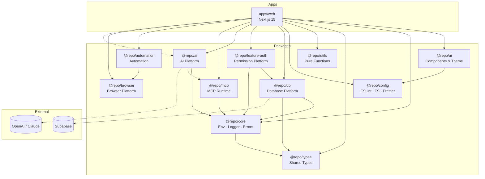

# AI SaaS Starter Kit

Production-ready boilerplate for building AI-powered SaaS applications — optimized for **long-term human + AI collaboration**, not just a quick demo.

> **Differentiator:** Documentation and Cursor rules are first-class citizens. Code follows the adapter pattern so Supabase, Prisma, or any DB can be swapped without rewriting your app.

---

## Architecture



**Layer flow (backend):**

```
Application → Service → Repository → Adapter → Database
Application → PermissionChecker → Authorization (@repo/feature-auth)
Application → ChatService → AI Platform (@repo/ai)
Application → MCPGateway → MCP Runtime (@repo/mcp)
Application → AutomationPlatform → Jobs & Pipelines (@repo/automation)
Application → BrowserPlatform → Playwright (@repo/browser)
Application → AuthPort → Supabase (Authentication)
```

---

## Stack

| Layer | Technology |
|-------|------------|
| Framework | Next.js 15 (App Router) |
| UI | React 19, Tailwind v4, shadcn/ui |
| Language | TypeScript (strict) |
| Monorepo | pnpm workspace |
| Validation | Zod + `@t3-oss/env-nextjs` |
| AI IDE | Cursor with `.cursor/rules/` |

---

## Project Structure

```
cursor-project/
├── apps/web/                 # Next.js application
├── packages/
│   ├── ui/                   # @repo/ui — design system
│   ├── core/                 # @repo/core — backend infrastructure
│   ├── types/                # @repo/types — shared types
│   ├── utils/                # @repo/utils — utilities
│   ├── config/               # @repo/config — shared configs
│   ├── db/                   # @repo/db — database platform
│   ├── ai/                   # @repo/ai — AI platform
│   ├── mcp/                  # @repo/mcp — MCP runtime
│   ├── automation/           # @repo/automation — jobs & pipelines
│   ├── browser/              # @repo/browser — Playwright browser platform
│   └── features/
│       └── auth/             # @repo/feature-auth — permission platform
├── docs/                     # Project operating system
├── .cursor/rules/            # AI behavior rules
└── .github/                  # Issue & PR templates
```

Full reference: [docs/PROJECT_STRUCTURE.md](./docs/PROJECT_STRUCTURE.md)

---

## Quick Start

### Prerequisites

- Node.js >= 20
- pnpm >= 9

### Install & Run

```bash
pnpm install
cp .env.example .env.local   # optional until Sprint 3
pnpm dev
```

Open [http://localhost:3000](http://localhost:3000)

### Verify

```bash
pnpm lint
pnpm build
```

---

## Workspace Packages

| Package | Description |
|---------|-------------|
| `@repo/ui` | shadcn/ui components, theme, layout primitives |
| `@repo/core` | Env validation, logger, errors, API response, validation |
| `@repo/types` | User, Role, API, Pagination types |
| `@repo/utils` | date, string, array, debounce, sleep, etc. |
| `@repo/config` | Shared ESLint, TypeScript, Prettier configs |
| `@repo/db` | Hexagonal database platform + Supabase adapter |
| `@repo/feature-auth` | Permission Platform — RBAC, guards, audit |
| `@repo/ai` | AI Platform — LLM adapters, chat, prompts, tools |
| `@repo/mcp` | MCP Runtime — workflows, tool registry, gateway |
| `@repo/automation` | Automation — scheduler, queue, jobs, pipelines |
| `@repo/browser` | Browser Platform — Playwright, crawl, screenshot, download |

---

## Sprint Process

```
Feature → PRD → Sprint (TASKS.md) → Implementation → Review → Release
```

| Sprint | Status | Focus |
|--------|--------|-------|
| 0 | ✅ | Monorepo + Next.js foundation |
| 1 | ✅ | UI (`@repo/ui`, shadcn, theme) |
| 2-1 | ✅ | Backend infrastructure (no DB) |
| 2-2 | ✅ | AI Project Operating System |
| 3 | ✅ | Database platform (`@repo/db`) |
| 4 | ✅ | Auth & Authorization Platform (`@repo/feature-auth`) |
| 5 | ✅ | AI Platform (`@repo/ai`) |
| 6 | ✅ | MCP Runtime (`@repo/mcp`) |
| 7 | ✅ | Automation Platform (`@repo/automation`) |
| 8 | ✅ | Browser Platform (`@repo/browser`, real Playwright) |
| 9 | ✅ | Naver Commerce MVP (first production feature) |
| 10 | 🔜 | Image Pipeline (promote when needed) |

Details: [docs/ROADMAP.md](./docs/ROADMAP.md) · [docs/TASKS.md](./docs/TASKS.md)

---

## Coding Conventions

- Server Components by default; `'use client'` only when needed
- UI in `@repo/ui` — never duplicate in apps
- No database SDK in apps or services — use repository adapters
- API responses use `ApiResponse<T>` envelope
- Input validated with Zod via `parseRequest`

Full guide: [docs/CODING_GUIDE.md](./docs/CODING_GUIDE.md)

---

## AI Workflow

This project is designed for **PM (human) + Developer (Cursor)** collaboration.

1. PM writes sprint prompt with goal, scope, completion criteria
2. Cursor reads `TASKS.md`, `DECISIONS.md`, `.cursor/rules/`
3. Cursor implements, updates docs, runs lint/build
4. PM reviews via checklist in `.cursor/rules/review-checklist.mdc`

Guides:

- [docs/AI_GUIDE.md](./docs/AI_GUIDE.md) — AI collaboration rules
- [docs/AI_WORKFLOW.md](./docs/AI_WORKFLOW.md) — Cursor / ChatGPT / Claude workflows
- [docs/DEVELOPMENT_WORKFLOW.md](./docs/DEVELOPMENT_WORKFLOW.md) — Feature → release flow

**Handoff phrase:** *"Sprint N 이어서 진행"* → AI loads full project context automatically.

---

## Documentation

### Product & Planning

| Doc | Description |
|-----|-------------|
| [PRD](./docs/PRD.md) | Product requirements |
| [ROADMAP](./docs/ROADMAP.md) | Sprint timeline |
| [TASKS](./docs/TASKS.md) | Current sprint tasks |
| [BACKLOG](./docs/BACKLOG.md) | Future work queue |
| [DECISIONS](./docs/DECISIONS.md) | Architecture Decision Records |

### Architecture

| Doc | Description |
|-----|-------------|
| [ARCHITECTURE](./docs/ARCHITECTURE.md) | Workspace & frontend |
| [BACKEND](./docs/BACKEND_ARCHITECTURE.md) | Backend layers & adapters |
| [AUTH_PLATFORM](./docs/AUTH_PLATFORM.md) | Authentication & Authorization |
| [RBAC](./docs/RBAC.md) | Role & permission matrices |
| [SECURITY_MODEL](./docs/SECURITY_MODEL.md) | Security boundaries & threat model |
| [AI_PLATFORM](./docs/AI_PLATFORM.md) | AI Platform overview |
| [LLM_ARCHITECTURE](./docs/LLM_ARCHITECTURE.md) | LLM adapter architecture |
| [MCP_PLATFORM](./docs/MCP_PLATFORM.md) | MCP Runtime overview |
| [AUTOMATION_PLATFORM](./docs/AUTOMATION_PLATFORM.md) | Automation Platform |
| [BROWSER_PLATFORM](./docs/BROWSER_PLATFORM.md) | Browser Platform (Playwright) |
| [NAVER_MVP](./docs/NAVER_MVP.md) | Naver Commerce MVP |
| [PROJECT_STRUCTURE](./docs/PROJECT_STRUCTURE.md) | Folder reference |

### Operations

| Doc | Description |
|-----|-------------|
| [CODING_GUIDE](./docs/CODING_GUIDE.md) | Code conventions |
| [CONTRIBUTING](./docs/CONTRIBUTING.md) | Contributor guide |
| [SECURITY](./docs/SECURITY.md) | Security practices |
| [TESTING](./docs/TESTING.md) | Test strategy |
| [DEPLOYMENT](./docs/DEPLOYMENT.md) | Deploy guide |
| [RELEASES](./docs/RELEASES.md) | Version history |

### Templates

[docs/templates/](./docs/templates/) — PRD, Sprint, API, DB, ADR, Feature

---

## License

[MIT](./LICENSE)
