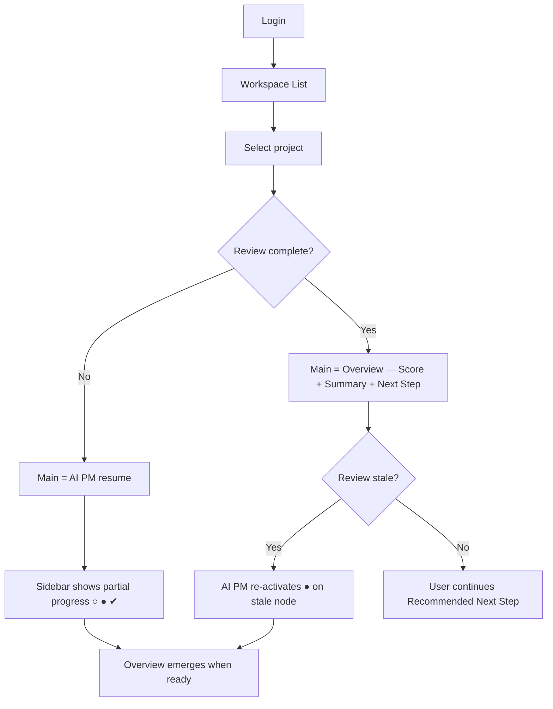
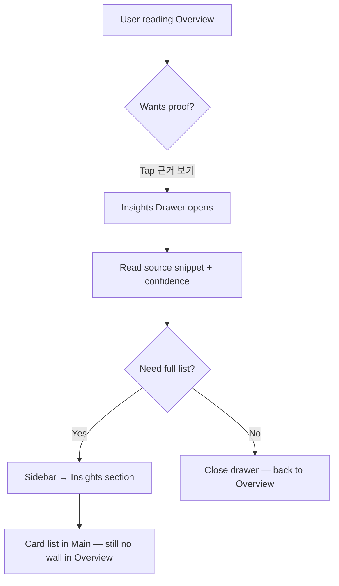
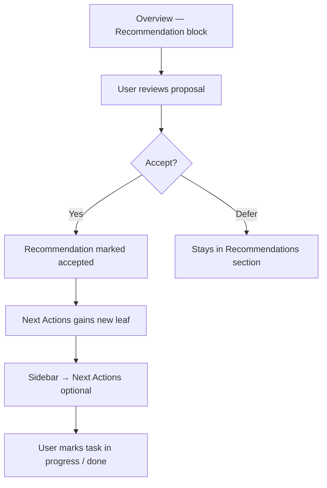
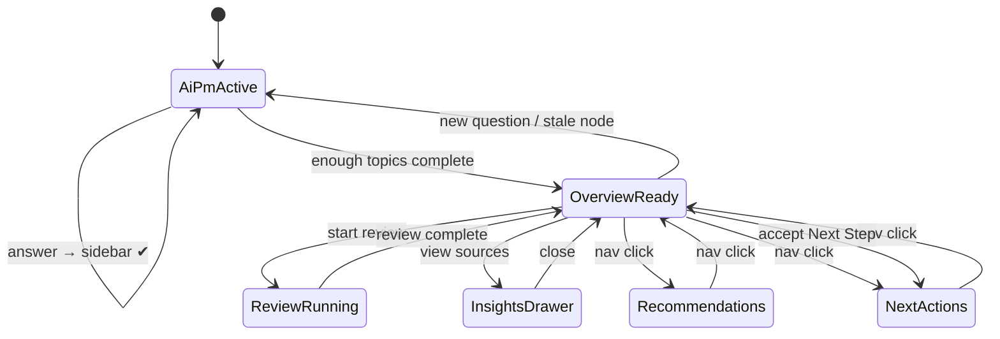

# Workspace Flow — Blueprint

> **Sprint Epic 2** · Companion to [`WORKSPACE_IA.md`](./WORKSPACE_IA.md)  
> **Status:** ✅ **CPO APPROVED** (2026-07-29)

This document defines **how users move through Project Workspace** — AI PM-first journeys, Sidebar lifecycle, section switching, and state transitions. It does not specify visual design or code.

---

## 1. LaunchLens canonical flow (CPO)

```text
Workspace
    ↓
AI PM                    ← first screen inside Project Workspace
    ↓
Overview                 ← generated as AI PM completes topics
    ↓
Insights
    ↓
Recommendations
    ↓
Next Actions
```

**Not:** Workspace → Overview (report-first).  
**Yes:** Workspace → AI PM → Overview (process-first).

---

## 2. Scope

| In scope | Out of scope |
|----------|--------------|
| User journeys (new / returning) | Pixel mockups |
| AI PM → Sidebar growth | New API routes |
| Overview block refresh cycle | Component refactors |
| Insights drawer trigger | Legacy file deletion |
| Recommended Next Step handoff | i18n string implementation |

---

## 3. Actors & entry points

| Actor | Entry | First screen inside Project Workspace |
|-------|-------|--------------------------------------|
| **New founder** | Login → bootstrap → `/who` → `/workflow` | **AI PM** — first question |
| **Returning founder** | Login → `/workspace` → pick project | **AI PM resume** OR **Overview** if review complete |
| **Demo visitor** | `/demo/enter` → `/who?demo=1` | **AI PM** (readonly/demo mode) |

**Single URL for all:** `/validation?project=:id` — sections are never separate routes.

---

## 4. Core user journeys

### 4.1 Journey A — First project (new user)

```mermaid
flowchart TD
  A[Login] --> B[Workspace List — bootstrap]
  B --> C[/who — persona]
  C --> D[/workflow — AI PM pre-interview]
  D --> E[Project Workspace opens]
  E --> F[Main = AI PM first question]
  F --> G[Sidebar: Overview → ○ Summary]
  G --> H[User answers]
  H --> I[Sidebar: ✔ Summary → ● Customer]
  I --> J{Enough topics for Overview?}
  J -->|No| F
  J -->|Yes| K[Main = Overview blocks emerge]
  K --> L[Business Score + Summary + Recommended Next Step]
  L --> M{User starts Next Step?}
  M -->|Yes| N[Next Actions unlocks in Sidebar]
  M -->|Defer| O[Stay on Overview / continue AI PM]
```

**Success criteria:** First paint is **AI PM**, not an empty Overview. Sidebar grows ○ → ● → ✔ after each answer.

### 4.2 Journey B — Returning user (existing project)



**Success criteria:** Complete review → **Business Score + Summary + Recommended Next Step** above fold — no hunt through scroll.

### 4.3 Journey C — View sources (Insights on demand)



**Rule:** Journey C never inserts a full evidence wall into Overview scroll.

### 4.4 Journey D — Accept recommendation → execute



---

## 5. AI PM progression model

### 5.1 Sidebar Lifecycle (every node)

```text
Waiting
    ↓
In Progress
    ↓
Completed
    ↓
Collapsed          ← optional; fold completed nodes
```

### 5.2 Navigation Node State

| Symbol | Lifecycle | Sidebar | Main |
|--------|-----------|---------|------|
| **○** | Waiting | Label visible, not done | — |
| **●** | In Progress | Bold + active dot | AI PM question for this topic |
| **✔** | Completed | Checkmark | Leaf summary on click |
| **✔ folded** | Collapsed | Hidden under expand | — |

Stale/re-review: ✔ node re-activates to **●** — no new symbol.

### 5.3 Topic progression example (CPO)

**Project start:**

```text
Overview
 ○ Summary
```

**After one question:**

```text
Overview
 ✔ Summary
 ● Customer
```

**After market research:**

```text
Overview
 ✔ Summary
 ✔ Customer
 ✔ Market
 ● Competitor
```

### 5.4 Default topic order (matches `WorkflowStepId` seed)

| Order | Topic (user label) | Internal step | Unlocks after |
|-------|-------------------|---------------|---------------|
| 1 | Summary | `review` (aggregate) | First AI PM round |
| 2 | Problem | `problem` | Idea captured |
| 3 | Customer | `customer` | Problem or parallel |
| 4 | Market | `market` | Customer + pricing minimum |
| 5 | Competitor | `competition` | Market review started |
| 6 | Pricing | `bm` | Customer defined |
| 7 | MVP scope | `mvp` | Optional depth |

Order may **compress** for returning users. Nav **never shrinks** without explicit project reset.

### 5.5 Question → Sidebar growth (detailed)

```
1. AI PM selects next incomplete topic T
2. Sidebar: T → ● In Progress
3. Main: AI PM question (thread mode — Overview not shown yet if first visit)
4. User submits answer
5. Persist evidence field linked to T
6. Sidebar: T → ✔ Completed; next T → ○ or ●
7. When threshold met → Overview blocks emerge in Main:
   - Business Score ← review aggregate
   - Summary ← verdict
   - Recommended Next Step ← next-action engine (inline)
   - Risk / Recommendation ← deltas
8. User taps [ Start ] on Recommended Next Step → Next Actions unlocks
```

**Anti-pattern:** Steps 3–7 happen without step 6 (nav unchanged) — **forbidden**.

---

## 6. Overview block refresh rules

When any of `{ evidence fields, review round, accepted recommendations }` changes:

| Block | Update trigger |
|-------|----------------|
| **Business Score** | Review round completes OR major strategy delta |
| **Summary** | Any ✔ leaf added or review round completes |
| **Recommended Next Step** | Always recomputed via next-action engine |
| **Risk** | Review round completes OR competitor/market leaf completes |
| **Recommendation** | Strategy delta detected OR user edits pricing/customer |

**Next Step engine priority (conceptual — matches `v2-next-action-engine` today):**

1. Missing idea → fill idea  
2. Missing customer/pricing → complete inputs  
3. Review not run → start review  
4. Investigation not viewed → view sources (drawer — not scroll)  
5. Stale review → re-review  
6. Else → customer validation or accept recommendation  

Only **one** Recommended Next Step surfaced — **inline after Summary**, not a separate card.

---

## 7. Section switching (no route change)

```
                    ┌─────────────┐
                    │   AI PM      │◄── first entry
                    └──────┬──────┘
                           │ topics complete
                           ▼
                    ┌─────────────┐
                    │   Overview   │
                    └──────┬──────┘
           ┌───────────────┼───────────────┐
           ▼               ▼               ▼
    ┌────────────┐  ┌─────────────┐  ┌─────────────┐
    │  Insights  │  │ Recommend.  │  │ Next Actions│
    └────────────┘  └─────────────┘  └─────────────┘
```

| From | To | Main behavior |
|------|-----|---------------|
| AI PM | Overview | Block stack emerges (Score → Summary → Next Step) |
| Overview home | Overview leaf | Leaf detail + back link |
| Overview | Insights | Card list; drawer available |
| Overview | Recommendations | Proposal list |
| Overview | Next Actions | Task list |
| Any section | AI PM | Resume if ● node active |

**Persistence:** Last mode + section + leaf stored per project.  
**GNB:** unchanged during section switch.

---

## 8. Loading & empty states

### 8.1 First open (no review yet)

| Zone | Content |
|------|---------|
| Sidebar | `Overview → ○ Summary` only |
| Main | **AI PM first question** — not Overview blocks |
| Insights | Not visible until first source |

### 8.2 Review in progress (`phase === reviewing`)

| Zone | Content |
|------|---------|
| Sidebar | ● on active topic |
| Main | Labeled steps ("Checking market…") — not blank spinner |
| Overview blocks | Not updated until review completes |

### 8.3 Demo / readonly

Same flow; Recommended Next Step shows explain tooltip instead of mutating state.

---

## 9. State diagram (Workspace session)



No state triggers a **route push** — only optional query sync.

---

## 10. Telemetry hooks (design — for Sprint 5.1+ continuity)

| Event | When |
|-------|------|
| `workspace_open` | Project Workspace mount |
| `ai_pm_question_view` | AI PM thread shown |
| `overview_section_view` | Section or leaf selected |
| `insights_drawer_open` | User opens sources |
| `next_step_impression` | Recommended Next Step rendered |
| `next_step_start` | User taps [ Start ] |
| `ai_pm_topic_complete` | Sidebar leaf → ✔ |

Events map to existing analytics pipeline; no new routes required.

---

## 11. QA scenarios (journey-based)

Epic 2 QA is **document review**. Epic 3+ implementation QA uses these journeys:

| # | Scenario | Pass condition |
|---|----------|----------------|
| 1 | New user opens project | Main = AI PM; Sidebar = ○ Summary |
| 2 | Complete 3 AI PM topics | Sidebar shows ○ ● ✔ progression |
| 3 | Overview emerges | Business Score + Summary + Recommended Next Step inline |
| 4 | Tap "근거 보기" | Drawer opens; no evidence wall in Overview scroll |
| 5 | Read Summary → Next Step | No separate Action card; [ Start ] immediately after Summary |
| 6 | Legacy `/execution` bookmark | Redirects to Project Workspace |

---

## 12. Implementation handoff (post sign-off)

| Step | Deliverable | Owner sprint |
|------|-------------|--------------|
| 1 | AI PM-first entry (Main default) | Epic 3 |
| 2 | Navigation tree + ○ ● ✔ lifecycle | Epic 3 |
| 3 | Overview block stack (Score → Summary → Next Step) | Epic 3 |
| 4 | Remove inline evidence from Main scroll | Epic 3 |
| 5 | Wire AI PM steps → nav nodes | Epic 3–4 |
| 6 | Delete `V2JourneyMiniNav` | Epic 3 |

**Do not start** until CPO signs — **signed 2026-07-29**. Implement per [`EPIC3_WORKSPACE_LAYOUT.md`](./sprints/EPIC3_WORKSPACE_LAYOUT.md).

---

## Related

- [`WORKSPACE_IA.md`](./WORKSPACE_IA.md) — structure & policies
- [`UX_RULES.md`](./UX_RULES.md) — UX law
- [`SCREEN_MAP.md`](./SCREEN_MAP.md) — routes
- [`ROUTE_QA.md`](./ROUTE_QA.md) — redirect verification
