# ALABOM Real Adaptive vNext — TRANSCRIPT (Production LIVE)

| Meta | Value |
|---|---|
| Captured at | 2026-08-30T00:20:26.108Z |
| Production SHA | `7df4764591bc76e7bd208412bef91f355bc366f7` |
| Entry | `/demo/start` |
| Harness | `_cpo-real-adaptive-prod-capture.spec.ts` |
| Meaningful answers | 16 |
| Duplicate / padding | 0 / 0 |

## Full turn bodies

### Turn 1 — 01-ai-read

**AI Q:** 

**User:** (seed)

**Delta:** (empty)

**Why now:** 

**Next Q:** 이번 질문 비슷한 역할을 이미 하고 있는 서비스가 있나요? 왜 지금 이 질문 · 이미 쓰는 대안·경쟁이 비면 차별화를 판단할 기준이 없습니다. 지금 쓰는 대안을 확인합니다.

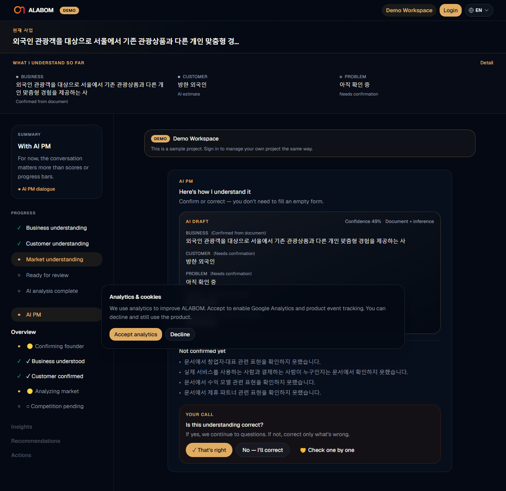

### Turn 2 — 02-first-ask

**AI Q:** 이번 질문 비슷한 역할을 이미 하고 있는 서비스가 있나요? 왜 지금 이 질문 · 이미 쓰는 대안·경쟁이 비면 차별화를 판단할 기준이 없습니다. 지금 쓰는 대안을 확인합니다.

**User:** (confirm)

**Delta:** (empty)

**Why now:** 왜 지금 이 질문 · 이미 쓰는 대안·경쟁이 비면 차별화를 판단할 기준이 없습니다. 지금 쓰는 대안을 확인합니다.

**Next Q:** 이번 질문 경쟁 대비 이 서비스만의 차별점은 무엇인가요? 왜 지금 이 질문 · 경쟁만 알고 차별이 없으면 「왜 우리인가」를 말할 수 없습니다. 차이점을 지금 확인합니다.

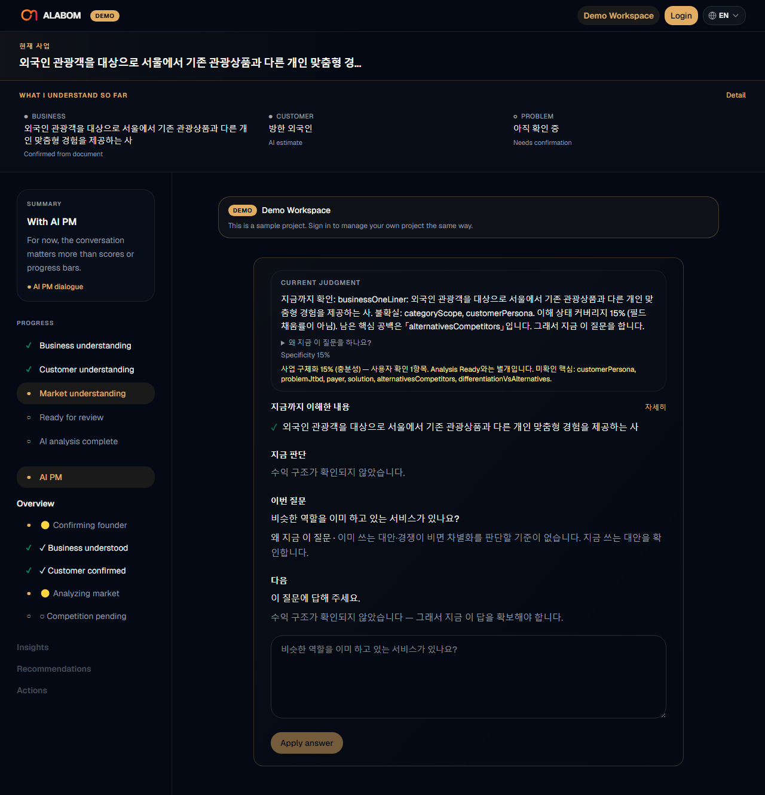

### Turn 3 — 03-first-substantive

**AI Q:** 이번 질문 경쟁 대비 이 서비스만의 차별점은 무엇인가요? 왜 지금 이 질문 · 경쟁만 알고 차별이 없으면 「왜 우리인가」를 말할 수 없습니다. 차이점을 지금 확인합니다.

**User:** 클룩·트립닷컴·가이드 매칭 앱이 이미 있지만, 대부분 카탈로그형 상품 나열이라 관심사·동선 맞춤이 약합니다.

**Delta:** 기존: businessOneLiner: 외국인 관광객을 대상으로 서울에서 기존 관광상품과 다른 개인 맞춤 · 신규: businessOneLiner: 외국인 관광객을 대상으로 서울에서 기존 관광상품과 다른 개인 맞춤형 경험을 제공하는 사 · alternativesCompetitors: 클룩·트립닷컴·가이드 매칭 앱이 이미 있지만, 대부분 카탈로그형 상품 나열이라 관심사· · 미확인: payer, problemJtbd, solution, revenueModel, differentiationVsAlternatives · 다음 공백: differentiationVsAlternatives

**Why now:** 왜 지금 이 질문 · 경쟁만 알고 차별이 없으면 「왜 우리인가」를 말할 수 없습니다. 차이점을 지금 확인합니다.

**Next Q:** 이번 질문 그 차별점이 고객에게 왜 중요한가요? 왜 지금 이 질문 · 차별점이 고객에게 왜 중요한지 모르면 검증 설계를 할 수 없습니다. 고객 관련성을 지금 확인합니다.

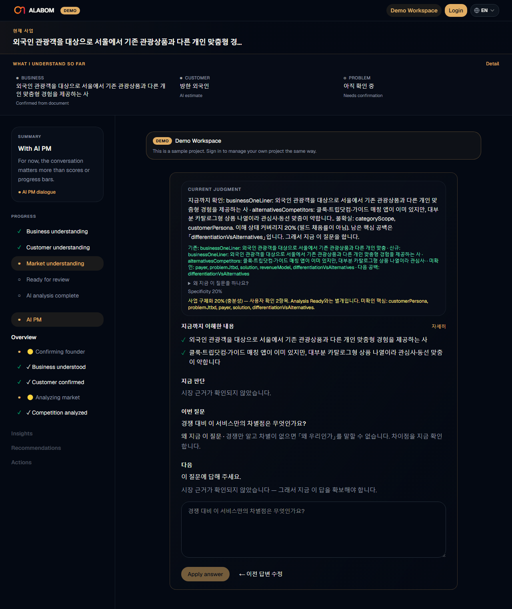

### Turn 4 — 04-second-substantive

**AI Q:** 이번 질문 그 차별점이 고객에게 왜 중요한가요? 왜 지금 이 질문 · 차별점이 고객에게 왜 중요한지 모르면 검증 설계를 할 수 없습니다. 고객 관련성을 지금 확인합니다.

**User:** 차별점은 관심사·동선·식사 제약까지 반영한 실시간 맞춤 일정과 현지인 동행을 한 번에 묶는 점입니다.

**Delta:** 기존: businessOneLiner: 외국인 관광객을 대상으로 서울에서 기존 관광상품과 다른 개인 맞춤 · alternativesCompetitors: 클룩·트립닷컴·가이드 매칭 앱이 이미 있지만, 대부분 카탈로그형 · 신규: differentiationHypothesis: 차별점은 관심사·동선·식사 제약까지 반영한 실시간 맞춤 일정과 현지인 동행을 한 번에 · differentiationVsAlternatives: 차별점은 관심사·동선·식사 제약까지 반영한 실시간 맞춤 일정과 현지인 동행을 한 번에 · 미확인: payer, problemJtbd, solution, revenueModel, validationTestability · 다음 공백: problemJtbd

**Why now:** 왜 지금 이 질문 · 차별점이 고객에게 왜 중요한지 모르면 검증 설계를 할 수 없습니다. 고객 관련성을 지금 확인합니다.

**Next Q:** 이번 질문 「차별점은 관심사·동선·식사 제약까지 반영한 실시간 맞춤 일정과 현…」가 「방한 외국인」에게 구체적으로 어떤 가치를 만드나요? 왜 지금 이 질문 · 이전 답은 사업 사실에 반영되지 않았습니다. 현재 이해(외국인 관광객을 대상으로 서울에서 기존 관광상품과 다른 개인 맞춤… · 방한 외국인 · 클룩·트립닷컴·가이드 매칭 앱이 이미 있지만, 대부…)를 기준으로 차별점이 고객에게 왜 중요한지 모르면 검증 설계를 할 수 없습니다. 고객 관련성을 지금 확인합니다.

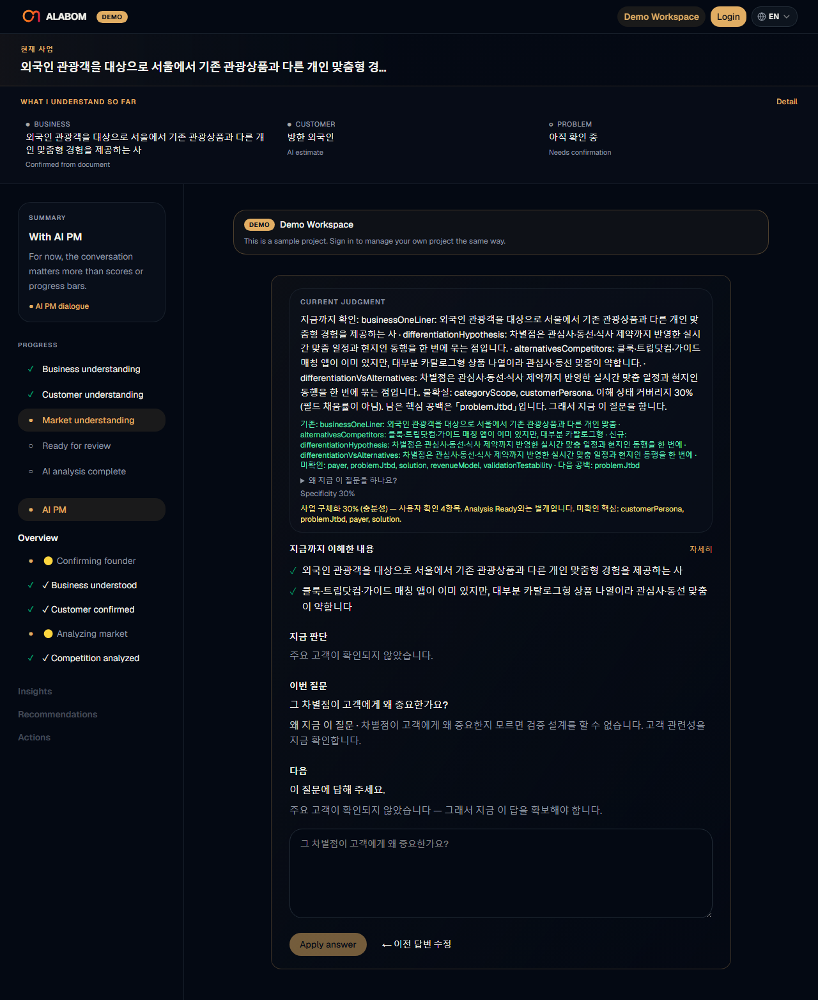

### Turn 5 — 05-nonsense

**AI Q:** 이번 질문 「차별점은 관심사·동선·식사 제약까지 반영한 실시간 맞춤 일정과 현…」가 「방한 외국인」에게 구체적으로 어떤 가치를 만드나요? 왜 지금 이 질문 · 이전 답은 사업 사실에 반영되지 않았습니다. 현재 이해(외국인 관광객을 대상으로 서울에서 기존 관광상품과 다른 개인 맞춤… · 방한 외국인 · 클룩·트립닷컴·가이드 매칭 앱이 이미 있지만, 대부…)를 기준으로 차별점이 고객에게 왜 중요한지 모르면 검증 설계를 할 수 없습니다. 고객 관련성을 지금 확인합니다.

**User:** ㅋㅋㅋㅋㅋㅋ

**Delta:** 기존: businessOneLiner: 외국인 관광객을 대상으로 서울에서 기존 관광상품과 다른 개인 맞춤 · alternativesCompetitors: 클룩·트립닷컴·가이드 매칭 앱이 이미 있지만, 대부분 카탈로그형 · 신규: differentiationHypothesis: 차별점은 관심사·동선·식사 제약까지 반영한 실시간 맞춤 일정과 현지인 동행을 한 번에 · differentiationVsAlternatives: 차별점은 관심사·동선·식사 제약까지 반영한 실시간 맞춤 일정과 현지인 동행을 한 번에 · 미확인: payer, problemJtbd, solution, revenueModel, validationTestability · 다음 공백: problemJtbd

**Why now:** 왜 지금 이 질문 · 이전 답은 사업 사실에 반영되지 않았습니다. 현재 이해(외국인 관광객을 대상으로 서울에서 기존 관광상품과 다른 개인 맞춤… · 방한 외국인 · 클룩·트립닷컴·가이드 매칭 앱이 이미 있지만, 대부…)를 기준으로 차별점이 고객에게 왜 중요한지 모르면 검증 설계를 할 수 없습니다. 고객 관련성을 지금 확인합니다.

**Next Q:** 이번 질문 현재 이해(외국인 관광객을 대상으로 서울에서 기존 관광상품과 다른 개인 맞춤… · 방한 외국인 · 클룩·트립닷컴·가이드 매칭 앱이 이미 있지만, 대부…)를 기준으로 다시 묻습니다 — 「차별점은 관심사·동선·식사 제약까지 반영한 실시간 맞춤 일정과 현…」가 「방한 외국인」에게 구체적으로 어떤 가치를 만드나요? 왜 지금 이 질문 · 왜 지금인지: 차별점이 고객에게 왜 중요한지 모르면 검증 설계를 할 수 없습니다. 고객 관련성을 지금 확인합니다. (현재 이해: 외국인 관광객을 대상으로 서울에서 기존 관광상품과 다른 개인 맞춤… · 방한 외국인 · 클룩·트립닷컴·가이드 매칭 앱이 이미 있지만, 대부…)

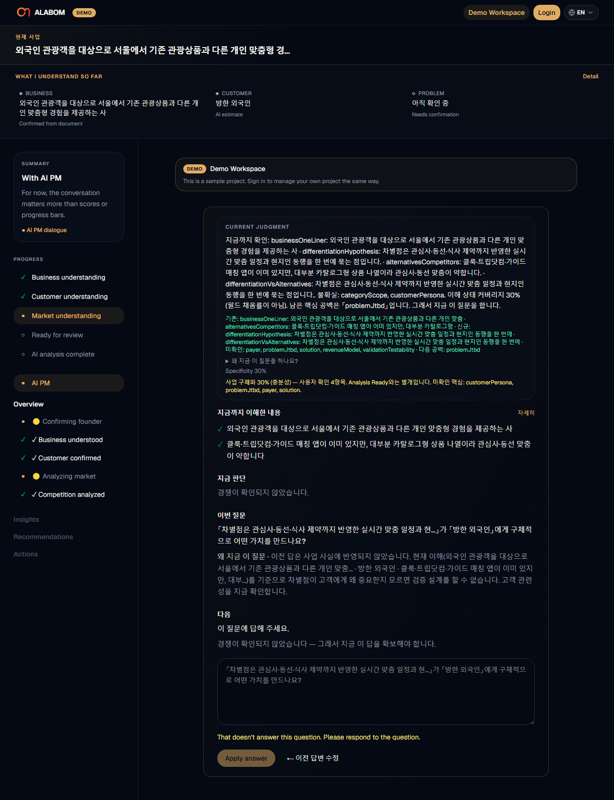

### Turn 6 — 06-why

**AI Q:** 이번 질문 현재 이해(외국인 관광객을 대상으로 서울에서 기존 관광상품과 다른 개인 맞춤… · 방한 외국인 · 클룩·트립닷컴·가이드 매칭 앱이 이미 있지만, 대부…)를 기준으로 다시 묻습니다 — 「차별점은 관심사·동선·식사 제약까지 반영한 실시간 맞춤 일정과 현…」가 「방한 외국인」에게 구체적으로 어떤 가치를 만드나요? 왜 지금 이 질문 · 왜 지금인지: 차별점이 고객에게 왜 중요한지 모르면 검증 설계를 할 수 없습니다. 고객 관련성을 지금 확인합니다. (현재 이해: 외국인 관광객을 대상으로 서울에서 기존 관광상품과 다른 개인 맞춤… · 방한 외국인 · 클룩·트립닷컴·가이드 매칭 앱이 이미 있지만, 대부…)

**User:** 왜 그게 중요하죠?

**Delta:** 기존: businessOneLiner: 외국인 관광객을 대상으로 서울에서 기존 관광상품과 다른 개인 맞춤 · alternativesCompetitors: 클룩·트립닷컴·가이드 매칭 앱이 이미 있지만, 대부분 카탈로그형 · 신규: differentiationHypothesis: 차별점은 관심사·동선·식사 제약까지 반영한 실시간 맞춤 일정과 현지인 동행을 한 번에 · differentiationVsAlternatives: 차별점은 관심사·동선·식사 제약까지 반영한 실시간 맞춤 일정과 현지인 동행을 한 번에 · 미확인: payer, problemJtbd, solution, revenueModel, validationTestability · 다음 공백: problemJtbd

**Why now:** 왜 지금 이 질문 · 왜 지금인지: 차별점이 고객에게 왜 중요한지 모르면 검증 설계를 할 수 없습니다. 고객 관련성을 지금 확인합니다. (현재 이해: 외국인 관광객을 대상으로 서울에서 기존 관광상품과 다른 개인 맞춤… · 방한 외국인 · 클룩·트립닷컴·가이드 매칭 앱이 이미 있지만, 대부…)

**Next Q:** 이번 질문 「차별점은 관심사·동선·식사 제약까지 반영한 실시간 맞춤 일정과 현…」가 「방한 외국인」에게 구체적으로 어떤 가치를 만드나요? 왜 지금 이 질문 · 중간 정리 후 재판단했습니다. 남은 핵심 공백「validationTestability」— 차별점이 고객에게 왜 중요한지 모르면 검증 설계를 할 수 없습니다. 고객 관련성을 지금 확인합니다.

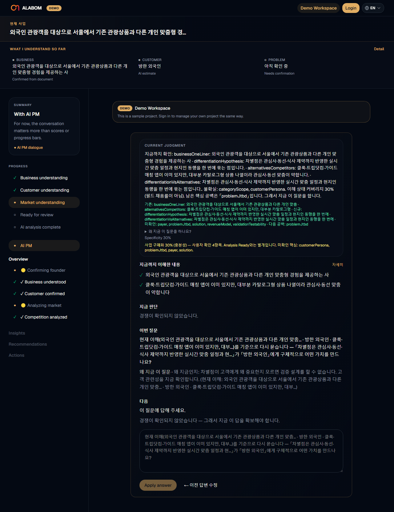

### Turn 7 — 07-mid-summary

**AI Q:** 이번 질문 「차별점은 관심사·동선·식사 제약까지 반영한 실시간 맞춤 일정과 현…」가 「방한 외국인」에게 구체적으로 어떤 가치를 만드나요? 왜 지금 이 질문 · 중간 정리 후 재판단했습니다. 남은 핵심 공백「validationTestability」— 차별점이 고객에게 왜 중요한지 모르면 검증 설계를 할 수 없습니다. 고객 관련성을 지금 확인합니다.

**User:** 지금까지 이해한 사업 정리해줘

**Delta:** 기존: businessOneLiner: 외국인 관광객을 대상으로 서울에서 기존 관광상품과 다른 개인 맞춤 · alternativesCompetitors: 클룩·트립닷컴·가이드 매칭 앱이 이미 있지만, 대부분 카탈로그형 · 신규: differentiationHypothesis: 차별점은 관심사·동선·식사 제약까지 반영한 실시간 맞춤 일정과 현지인 동행을 한 번에 · differentiationVsAlternatives: 차별점은 관심사·동선·식사 제약까지 반영한 실시간 맞춤 일정과 현지인 동행을 한 번에 · 미확인: payer, problemJtbd, solution, revenueModel, validationTestability · 다음 공백: problemJtbd

**Why now:** 왜 지금 이 질문 · 중간 정리 후 재판단했습니다. 남은 핵심 공백「validationTestability」— 차별점이 고객에게 왜 중요한지 모르면 검증 설계를 할 수 없습니다. 고객 관련성을 지금 확인합니다.

**Next Q:** 이번 질문 「차별점은 관심사·동선·식사 제약까지 반영한 실시간 맞춤 일정과 현…」가 「방한 외국인」에게 구체적으로 어떤 가치를 만드나요? 왜 지금 이 질문 · 차별점이 고객에게 왜 중요한지 모르면 검증 설계를 할 수 없습니다. 고객 관련성을 지금 확인합니다. (현재 이해: 외국인 관광객을 대상으로 서울에서 기존 관광상품과 다른 개인 맞춤… · 방한 외국인 · 클룩·트립닷컴·가이드 매칭 앱이 이미 있지만, 대부…)

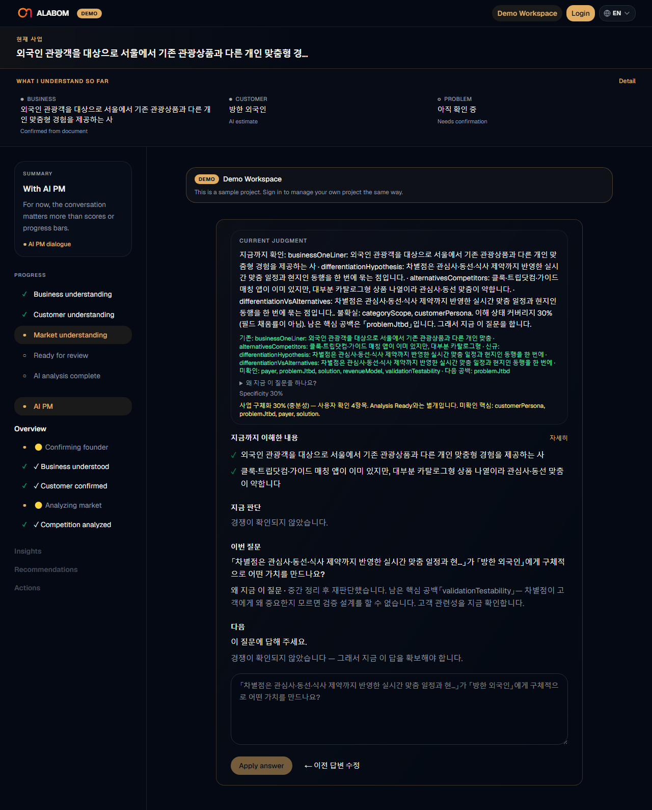

### Turn 8 — 08-prior-edit

**AI Q:** 이번 질문 「차별점은 관심사·동선·식사 제약까지 반영한 실시간 맞춤 일정과 현…」가 「방한 외국인」에게 구체적으로 어떤 가치를 만드나요? 왜 지금 이 질문 · 차별점이 고객에게 왜 중요한지 모르면 검증 설계를 할 수 없습니다. 고객 관련성을 지금 확인합니다. (현재 이해: 외국인 관광객을 대상으로 서울에서 기존 관광상품과 다른 개인 맞춤… · 방한 외국인 · 클룩·트립닷컴·가이드 매칭 앱이 이미 있지만, 대부…)

**User:** 정정합니다. 초기 타깃은 방한 FIT 외국인만이 아니라, 국내 MZ 개별 여행객도 포함합니다.

**Delta:** 기존: businessOneLiner: 외국인 관광객을 대상으로 서울에서 기존 관광상품과 다른 개인 맞춤 · alternativesCompetitors: 클룩·트립닷컴·가이드 매칭 앱이 이미 있지만, 대부분 카탈로그형 · 신규: differentiationHypothesis: 차별점은 관심사·동선·식사 제약까지 반영한 실시간 맞춤 일정과 현지인 동행을 한 번에 · differentiationVsAlternatives: 차별점은 관심사·동선·식사 제약까지 반영한 실시간 맞춤 일정과 현지인 동행을 한 번에 · 미확인: payer, problemJtbd, solution, revenueModel, validationTestability · 다음 공백: problemJtbd

**Why now:** 왜 지금 이 질문 · 차별점이 고객에게 왜 중요한지 모르면 검증 설계를 할 수 없습니다. 고객 관련성을 지금 확인합니다. (현재 이해: 외국인 관광객을 대상으로 서울에서 기존 관광상품과 다른 개인 맞춤… · 방한 외국인 · 클룩·트립닷컴·가이드 매칭 앱이 이미 있지만, 대부…)

**Next Q:** 이번 질문 현재 이해(외국인 관광객을 대상으로 서울에서 기존 관광상품과 다른 개인 맞춤… · 방한 외국인 · 클룩·트립닷컴·가이드 매칭 앱이 이미 있지만, 대부…)를 기준으로 다시 묻습니다 — 「차별점은 관심사·동선·식사 제약까지 반영한 실시간 맞춤 일정과 현…」가 「방한 외국인」에게 구체적으로 어떤 가치를 만드나요? 왜 지금 이 질문 · 차별점이 고객에게 왜 중요한지 모르면 검증 설계를 할 수 없습니다. 고객 관련성을 지금 확인합니다. (현재 이해: 외국인 관광객을 대상으로 서울에서 기존 관광상품과 다른 개인 맞춤… · 방한 외국인 · 클룩·트립닷컴·가이드 매칭 앱이 이미 있지만, 대부…)

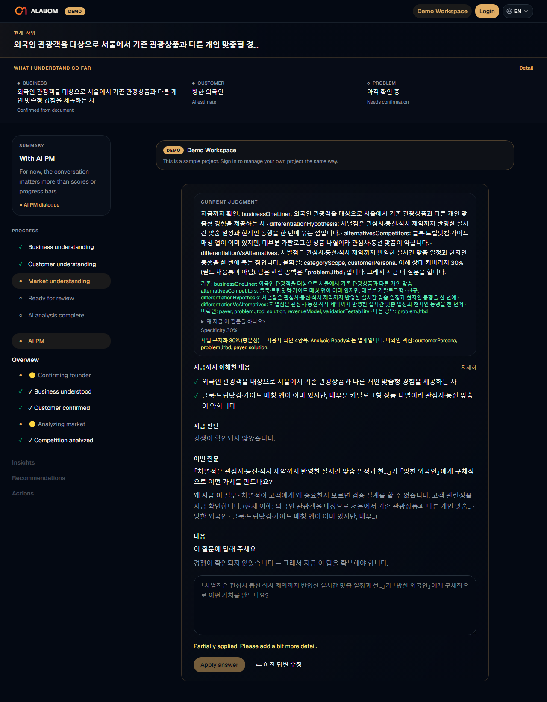

### Turn 9 — 09-contradiction

**AI Q:** 이번 질문 현재 이해(외국인 관광객을 대상으로 서울에서 기존 관광상품과 다른 개인 맞춤… · 방한 외국인 · 클룩·트립닷컴·가이드 매칭 앱이 이미 있지만, 대부…)를 기준으로 다시 묻습니다 — 「차별점은 관심사·동선·식사 제약까지 반영한 실시간 맞춤 일정과 현…」가 「방한 외국인」에게 구체적으로 어떤 가치를 만드나요? 왜 지금 이 질문 · 차별점이 고객에게 왜 중요한지 모르면 검증 설계를 할 수 없습니다. 고객 관련성을 지금 확인합니다. (현재 이해: 외국인 관광객을 대상으로 서울에서 기존 관광상품과 다른 개인 맞춤… · 방한 외국인 · 클룩·트립닷컴·가이드 매칭 앱이 이미 있지만, 대부…)

**User:** 앞서와 달리 정정합니다. 결제자는 관광객이 아니라 B2B로 호텔·OTA가 일괄 정산합니다.

**Delta:** 기존: businessOneLiner: 외국인 관광객을 대상으로 서울에서 기존 관광상품과 다른 개인 맞춤 · alternativesCompetitors: 클룩·트립닷컴·가이드 매칭 앱이 이미 있지만, 대부분 카탈로그형 · 신규: differentiationHypothesis: 차별점은 관심사·동선·식사 제약까지 반영한 실시간 맞춤 일정과 현지인 동행을 한 번에 · differentiationVsAlternatives: 차별점은 관심사·동선·식사 제약까지 반영한 실시간 맞춤 일정과 현지인 동행을 한 번에 · 미확인: payer, problemJtbd, solution, revenueModel, validationTestability · 다음 공백: problemJtbd

**Why now:** 왜 지금 이 질문 · 차별점이 고객에게 왜 중요한지 모르면 검증 설계를 할 수 없습니다. 고객 관련성을 지금 확인합니다. (현재 이해: 외국인 관광객을 대상으로 서울에서 기존 관광상품과 다른 개인 맞춤… · 방한 외국인 · 클룩·트립닷컴·가이드 매칭 앱이 이미 있지만, 대부…)

**Next Q:** 이번 질문 「차별점은 관심사·동선·식사 제약까지 반영한 실시간 맞춤 일정과 현…」가 「방한 외국인」에게 구체적으로 어떤 가치를 만드나요? 왜 지금 이 질문 · 차별점이 고객에게 왜 중요한지 모르면 검증 설계를 할 수 없습니다. 고객 관련성을 지금 확인합니다. (현재 이해: 외국인 관광객을 대상으로 서울에서 기존 관광상품과 다른 개인 맞춤… · 방한 외국인 · 그건 아닌데? 결제자는 관광객 직접 결제가 …)

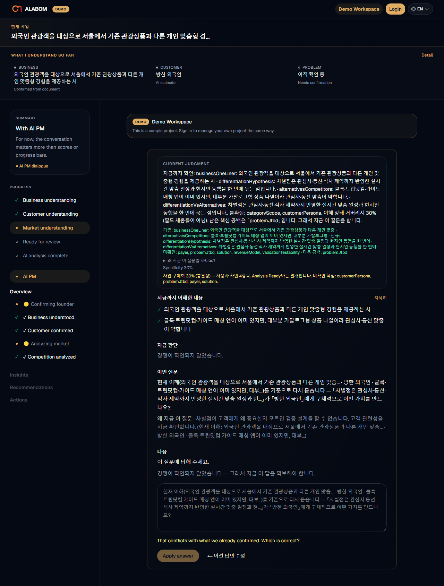

### Turn 10 — 09b-not-that

**AI Q:** 이번 질문 「차별점은 관심사·동선·식사 제약까지 반영한 실시간 맞춤 일정과 현…」가 「방한 외국인」에게 구체적으로 어떤 가치를 만드나요? 왜 지금 이 질문 · 차별점이 고객에게 왜 중요한지 모르면 검증 설계를 할 수 없습니다. 고객 관련성을 지금 확인합니다. (현재 이해: 외국인 관광객을 대상으로 서울에서 기존 관광상품과 다른 개인 맞춤… · 방한 외국인 · 그건 아닌데? 결제자는 관광객 직접 결제가 …)

**User:** 그건 아닌데? 결제자는 관광객 직접 결제가 맞고, B2B 정산은 아닙니다.

**Delta:** 기존: businessOneLiner: 외국인 관광객을 대상으로 서울에서 기존 관광상품과 다른 개인 맞춤 · differentiationHypothesis: 차별점은 관심사·동선·식사 제약까지 반영한 실시간 맞춤 일정과 현 · alternativesCompetitors: 클룩·트립닷컴·가이드 매칭 앱이 이미 있지만, 대부분 카탈로그형 · 신규: payer: 그건 아닌데? 결제자는 관광객 직접 결제가 맞고, B2B 정산은 아닙니다. · 미확인: problemJtbd, solution, revenueModel, validationTestability, customerPersona · 다음 공백: problemJtbd

**Why now:** 왜 지금 이 질문 · 차별점이 고객에게 왜 중요한지 모르면 검증 설계를 할 수 없습니다. 고객 관련성을 지금 확인합니다. (현재 이해: 외국인 관광객을 대상으로 서울에서 기존 관광상품과 다른 개인 맞춤… · 방한 외국인 · 그건 아닌데? 결제자는 관광객 직접 결제가 …)

**Next Q:** 이번 질문 현재 이해(외국인 관광객을 대상으로 서울에서 기존 관광상품과 다른 개인 맞춤… · 방한 외국인 · 그건 아닌데? 왜 지금 이 질문 · 차별점이 고객에게 왜 중요한지 모르면 검증 설계를 할 수 없습니다. 고객 관련성을 지금 확인합니다. (현재 이해: 외국인 관광객을 대상으로 서울에서 기존 관광상품과 다른 개인 맞춤… · 방한 외국인 · 그건 아닌데? 결제자는 관광객 직접 결제가 …)

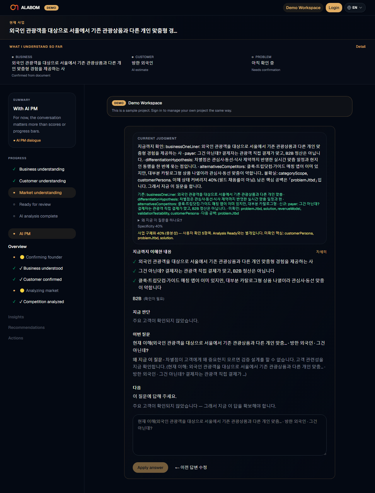

### Turn 11 — 10-adaptive-l1-validation

**AI Q:** 이번 질문 현재 이해(외국인 관광객을 대상으로 서울에서 기존 관광상품과 다른 개인 맞춤… · 방한 외국인 · 그건 아닌데? 왜 지금 이 질문 · 차별점이 고객에게 왜 중요한지 모르면 검증 설계를 할 수 없습니다. 고객 관련성을 지금 확인합니다. (현재 이해: 외국인 관광객을 대상으로 서울에서 기존 관광상품과 다른 개인 맞춤… · 방한 외국인 · 그건 아닌데? 결제자는 관광객 직접 결제가 …)

**User:** 검증 계획: 2주간 가이드 10명 인터뷰 + 랜딩 CTA 클릭으로 관심도를 측정합니다.

**Delta:** 기존: businessOneLiner: 외국인 관광객을 대상으로 서울에서 기존 관광상품과 다른 개인 맞춤 · differentiationHypothesis: 차별점은 관심사·동선·식사 제약까지 반영한 실시간 맞춤 일정과 현 · alternativesCompetitors: 클룩·트립닷컴·가이드 매칭 앱이 이미 있지만, 대부분 카탈로그형 · 신규: payer: 그건 아닌데? 결제자는 관광객 직접 결제가 맞고, B2B 정산은 아닙니다. · 미확인: problemJtbd, solution, revenueModel, validationTestability, customerPersona · 다음 공백: problemJtbd

**Why now:** 왜 지금 이 질문 · 차별점이 고객에게 왜 중요한지 모르면 검증 설계를 할 수 없습니다. 고객 관련성을 지금 확인합니다. (현재 이해: 외국인 관광객을 대상으로 서울에서 기존 관광상품과 다른 개인 맞춤… · 방한 외국인 · 그건 아닌데? 결제자는 관광객 직접 결제가 …)

**Next Q:** 이번 질문 이 서비스를 실제로 가장 필요로 하는 사람은 누구인가요? 왜 지금 이 질문 · 방금 확인한 고객 관련성과 별도로, 타깃 고객은 아직 미확인입니다. 고객이 넓거나 미정이면 검증·메시지 설계가 흔들립니다. 가장 필요로 하는 사람을 지금 좁힙니다.

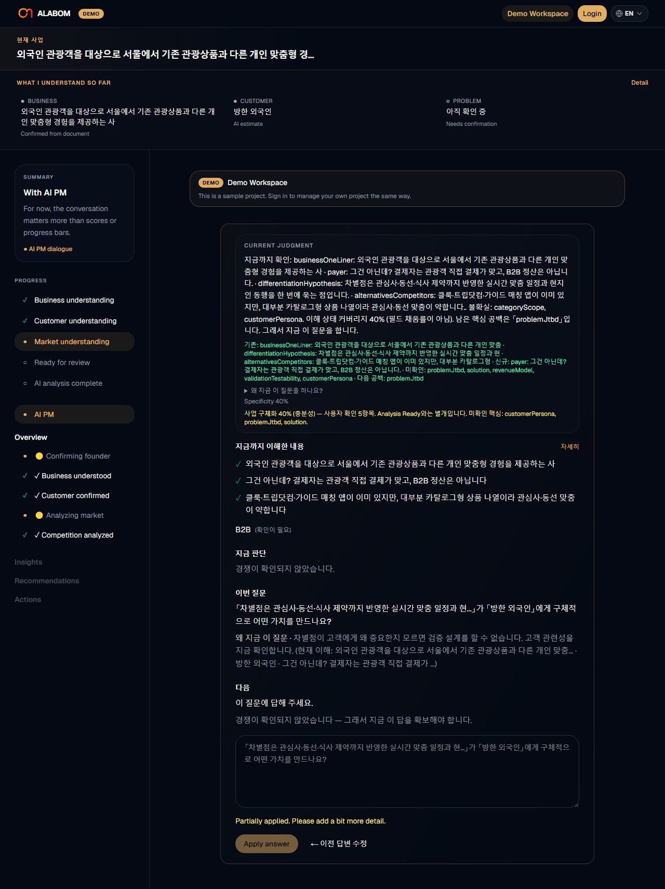

### Turn 12 — 10-adaptive-l2-adaptive

**AI Q:** 이번 질문 이 서비스를 실제로 가장 필요로 하는 사람은 누구인가요? 왜 지금 이 질문 · 방금 확인한 고객 관련성과 별도로, 타깃 고객은 아직 미확인입니다. 고객이 넓거나 미정이면 검증·메시지 설계가 흔들립니다. 가장 필요로 하는 사람을 지금 좁힙니다.

**User:** 맞춤 일정이 없으면 첫날부터 동선 낭비가 커서, 고객은 예약 전에 차이를 체감합니다.

**Delta:** 기존: businessOneLiner: 외국인 관광객을 대상으로 서울에서 기존 관광상품과 다른 개인 맞춤 · payer: 그건 아닌데? 결제자는 관광객 직접 결제가 맞고, B2B 정산은 · differentiationHypothesis: 차별점은 관심사·동선·식사 제약까지 반영한 실시간 맞춤 일정과 현 · 신규: validationTestability: 맞춤 일정이 없으면 첫날부터 동선 낭비가 커서, 고객은 예약 전에 차이를 체감합니다. · 미확인: problemJtbd, solution, customerPersona · 다음 공백: problemJtbd

**Why now:** 왜 지금 이 질문 · 방금 확인한 고객 관련성과 별도로, 타깃 고객은 아직 미확인입니다. 고객이 넓거나 미정이면 검증·메시지 설계가 흔들립니다. 가장 필요로 하는 사람을 지금 좁힙니다.

**Next Q:** 이번 질문 지금 가장 크게 해결하려는 불편은 무엇인가요? 왜 지금 이 질문 · 해결하려는 불편이 비어 있으면 사업 판단의 출발점이 없습니다. 핵심 문제를 먼저 고정합니다.

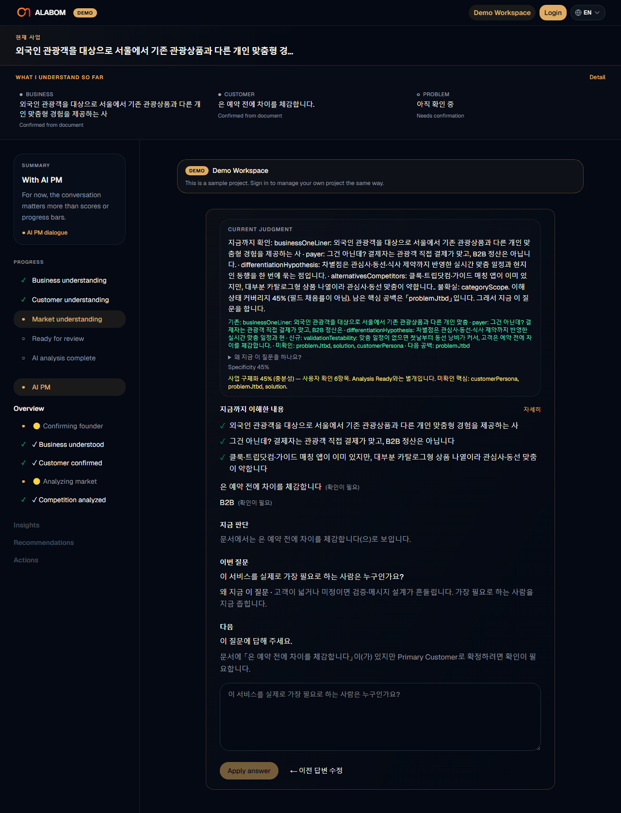

### Turn 13 — 10-adaptive-l3-adaptive

**AI Q:** 이번 질문 지금 가장 크게 해결하려는 불편은 무엇인가요? 왜 지금 이 질문 · 해결하려는 불편이 비어 있으면 사업 판단의 출발점이 없습니다. 핵심 문제를 먼저 고정합니다.

**User:** 초기 타깃은 서울을 3~7일 방문하는 FIT 외국인(밀레니얼·MZ)이고, 혼자 또는 2인 여행이 많습니다.

**Delta:** 기존: businessOneLiner: 외국인 관광객을 대상으로 서울에서 기존 관광상품과 다른 개인 맞춤 · payer: 그건 아닌데? 결제자는 관광객 직접 결제가 맞고, B2B 정산은 · differentiationHypothesis: 차별점은 관심사·동선·식사 제약까지 반영한 실시간 맞춤 일정과 현 · 변경: customerPersona: 은 예약 전에 차이를 체감합니다. → 초기 타깃은 서울을 3~7일 방문하는 FIT 외국인(밀레니 · 미확인: problemJtbd, solution · 다음 공백: problemJtbd

**Why now:** 왜 지금 이 질문 · 해결하려는 불편이 비어 있으면 사업 판단의 출발점이 없습니다. 핵심 문제를 먼저 고정합니다.

**Next Q:** 이번 질문 문제를 해결하는 방식(제공 가치)은 무엇인가요?

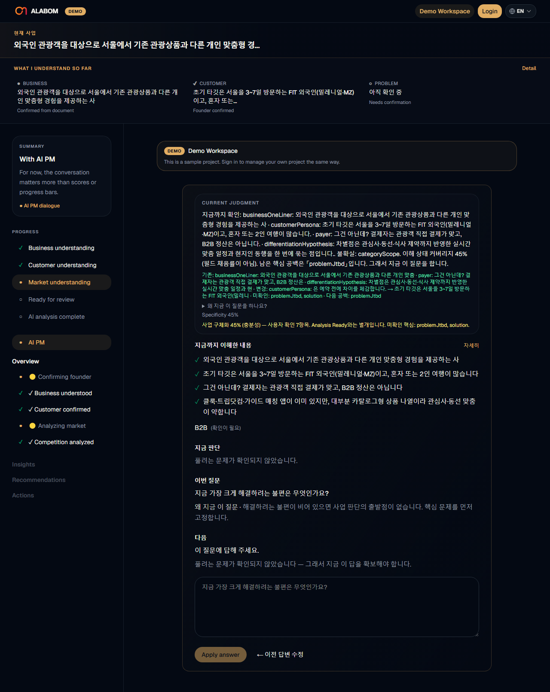

### Turn 14 — 10-adaptive-l4-adaptive

**AI Q:** 이번 질문 문제를 해결하는 방식(제공 가치)은 무엇인가요?

**User:** 패키지 투어는 동선이 획일적이고, 혼자 계획하면 언어·시간 때문에 현지인 일상에 가까운 경험을 놓칩니다. 관심사와 체류일수에 맞춘 반나절 단위 맞춤 일정이 필요합니다.

**Delta:** 기존: businessOneLiner: 외국인 관광객을 대상으로 서울에서 기존 관광상품과 다른 개인 맞춤 · customerPersona: 초기 타깃은 서울을 3~7일 방문하는 FIT 외국인(밀레니얼·MZ · payer: 그건 아닌데? 결제자는 관광객 직접 결제가 맞고, B2B 정산은 · 신규: problemJtbd: 패키지 투어는 동선이 획일적이고, 혼자 계획하면 언어·시간 때문에 현지인 일상에 가까운 · 미확인: solution · 다음 공백: solution

**Why now:** 왜 지금 이 질문을 하나요?

**Next Q:** 이번 질문 이 서비스를 실제로 가장 필요로 하는 사람은 누구인가요?

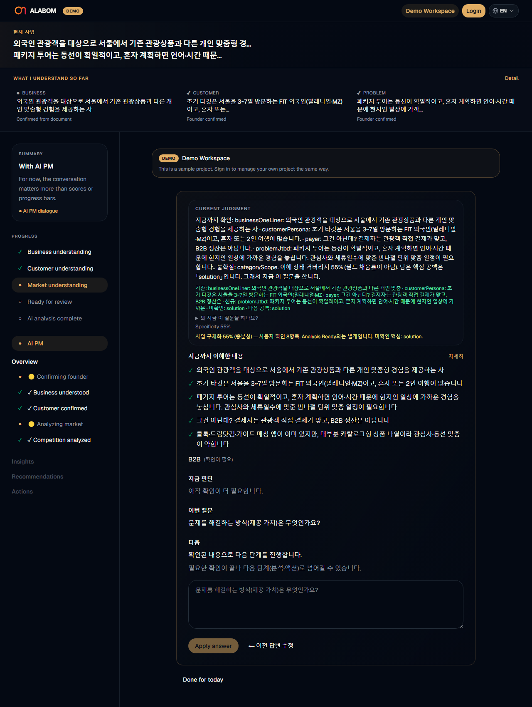

### Turn 15 — 10-adaptive-l5-solution

**AI Q:** 이번 질문 이 서비스를 실제로 가장 필요로 하는 사람은 누구인가요?

**User:** 관심사·동선·식사 제약을 반영한 실시간 맞춤 일정과 현지인 동행을 한 번에 제공하는 방식입니다.

**Delta:** 충돌: business — 기존 값과 새 답 중 어느 쪽이 맞는지 확인 필요 · 미확인: solution

**Why now:** 왜 지금 이 질문을 하나요?

**Next Q:** 이번 질문 경쟁사가 따라오기 어려운 방어력은 무엇인가요? 왜 지금 이 질문 · 따라오기 어려운 방어력이 비면 「지속 가능한 차별」을 판단할 수 없습니다. 방어력을 지금 확인합니다.

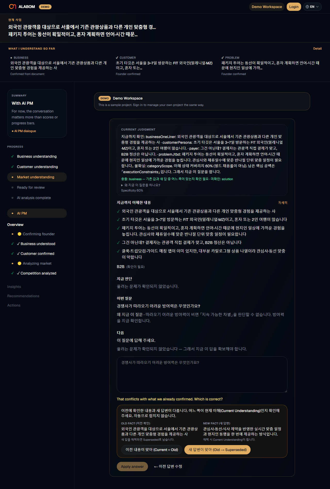

### Turn 16 — 10-adaptive-l6-adaptive

**AI Q:** 이번 질문 경쟁사가 따라오기 어려운 방어력은 무엇인가요? 왜 지금 이 질문 · 따라오기 어려운 방어력이 비면 「지속 가능한 차별」을 판단할 수 없습니다. 방어력을 지금 확인합니다.

**User:** 관광객이 앱에서 일정·체험을 직접 예약·결제합니다.

**Delta:** 기존: problemJtbd: 패키지 투어는 동선이 획일적이고, 혼자 계획하면 언어·시간 때문에 · problemFrequencySeverity: [AI PM 확인 · 문제 확인] · solution: 관심사·동선·식사 제약을 반영한 실시간 맞춤 일정과 현지인 동행을 · 변경: businessOneLiner: 관심사·동선·식사 제약을 반영한 실시간 맞춤 일정과 현지인 → 외국인 관광객을 대상으로 서울에서 기존 관광상품과 다른 개 · customerPersona: 초기 타깃은 서울을 3~7일 방문하는 FIT 외국인(밀레니 → 관광객이 앱에서 일정·체험을 직접 예약·결제합니다. · payer: 그건 아닌데? 결제자는 관광객 직접 결제가 맞고, B2B → 관광객이 앱에서 일정·체험을 직접 예약·결제합니다. · 다음 공백: executionConstraints

**Why now:** 왜 지금 이 질문 · 따라오기 어려운 방어력이 비면 「지속 가능한 차별」을 판단할 수 없습니다. 방어력을 지금 확인합니다.

**Next Q:** 이번 질문 수익은 어떤 구조로 발생하나요? 왜 지금 이 질문 · 수익 구조가 비면 지속 가능성을 판단할 수 없습니다. 누가·어떻게 돈을 버는지 확인합니다.

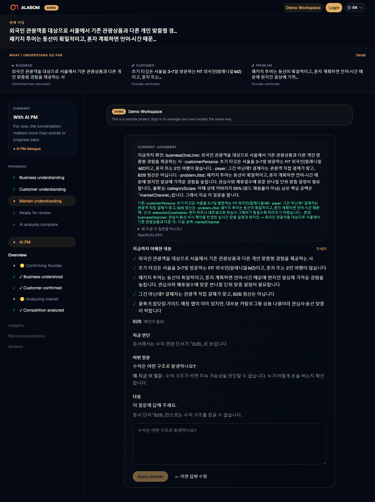

### Turn 17 — 10-adaptive-l7-defensibility

**AI Q:** 이번 질문 수익은 어떤 구조로 발생하나요? 왜 지금 이 질문 · 수익 구조가 비면 지속 가능성을 판단할 수 없습니다. 누가·어떻게 돈을 버는지 확인합니다.

**User:** 현지 파트너 네트워크와 관심사 그래프가 쌓일수록 따라오기 어렵습니다.

**Delta:** 기존: businessOneLiner: 외국인 관광객을 대상으로 서울에서 기존 관광상품과 다른 개인 맞춤 · customerPersona: 관광객이 앱에서 일정·체험을 직접 예약·결제합니다. · payer: 관광객이 앱에서 일정·체험을 직접 예약·결제합니다. · 신규: executionConstraints: 현지 파트너 네트워크와 관심사 그래프가 쌓일수록 따라오기 어렵습니다. · 다음 공백: marketChannel

**Why now:** 왜 지금 이 질문 · 수익 구조가 비면 지속 가능성을 판단할 수 없습니다. 누가·어떻게 돈을 버는지 확인합니다.

**Next Q:** 이번 질문 이 시장에 수요가 있다는 근거는 무엇인가요? 왜 지금 이 질문 · 시장·수요 근거가 없으면 규모 판단을 할 수 없습니다.

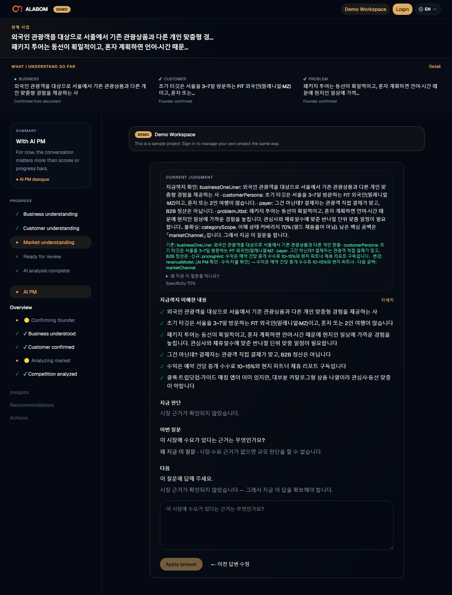

### Turn 18 — 10-adaptive-l8-revenue

**AI Q:** 이번 질문 이 시장에 수요가 있다는 근거는 무엇인가요? 왜 지금 이 질문 · 시장·수요 근거가 없으면 규모 판단을 할 수 없습니다.

**User:** 수익은 예약 건당 중개 수수료 10~15%와 현지 파트너 제휴 리포트 구독입니다.

**Delta:** 기존: businessOneLiner: 외국인 관광객을 대상으로 서울에서 기존 관광상품과 다른 개인 맞춤 · customerPersona: 관광객이 앱에서 일정·체험을 직접 예약·결제합니다. · payer: 관광객이 앱에서 일정·체험을 직접 예약·결제합니다. · 신규: pricingHint: 수익은 예약 건당 중개 수수료 10~15%와 현지 파트너 제휴 리포트 구독입니다. · 변경: revenueModel: [AI PM 확인 · 수익·지불 확인] → 수익은 예약 건당 중개 수수료 10~15%와 현지 파트너 · 다음 공백: marketChannel

**Why now:** 왜 지금 이 질문 · 시장·수요 근거가 없으면 규모 판단을 할 수 없습니다.

**Next Q:** 

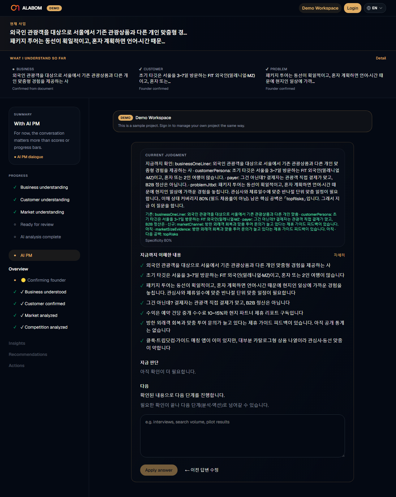

### Turn 19 — 10-adaptive-l9-demand

**AI Q:** 

**User:** 방한 외래객 회복과 맞춤 투어 문의가 늘고 있다는 제휴 가이드 피드백이 있습니다. 아직 공개 통계는 없습니다.

**Delta:** 기존: businessOneLiner: 외국인 관광객을 대상으로 서울에서 기존 관광상품과 다른 개인 맞춤 · customerPersona: 관광객이 앱에서 일정·체험을 직접 예약·결제합니다. · payer: 관광객이 앱에서 일정·체험을 직접 예약·결제합니다. · 신규: marketChannel: 방한 외래객 회복과 맞춤 투어 문의가 늘고 있다는 제휴 가이드 피드백이 있습니다. 아직 · marketSizeEvidence: 방한 외래객 회복과 맞춤 투어 문의가 늘고 있다는 제휴 가이드 피드백이 있습니다. 아직 · 다음 공백: topRisks

**Why now:** 

**Next Q:** 

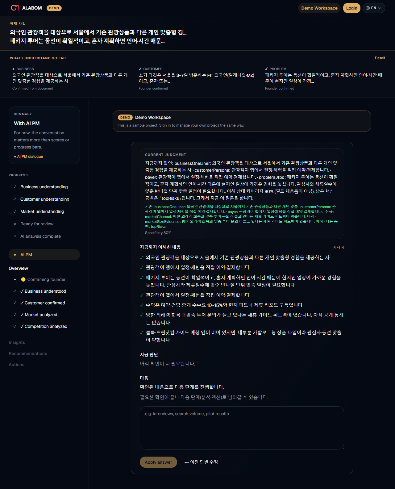

### Turn 20 — 10-adaptive-l10-adaptive

**AI Q:** 

**User:** 아직 MVP 전 아이디어 단계이고, 서울 한정으로 관심사 기반 맞춤 반나절 체험을 먼저 검증하려 합니다.

**Delta:** 충돌: market — 기존 값과 새 답 중 어느 쪽이 맞는지 확인 필요 · 미확인: marketSizeEvidence

**Why now:** 

**Next Q:** 

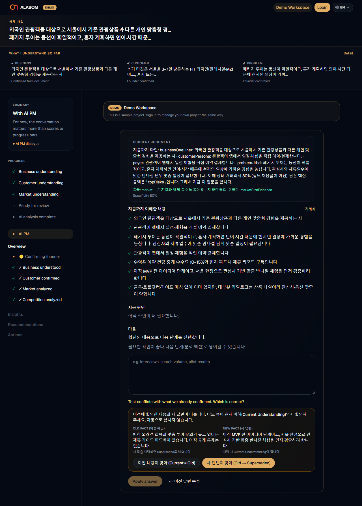

### Turn 21 — 10-adaptive-l11-adaptive

**AI Q:** 

**User:** MVP는 서울 한정·관심사 3종(미식·야경·로컬)으로 좁혀 2주 파일럿으로 수요를 확인합니다.

**Delta:** (empty)

**Why now:** 

**Next Q:** 

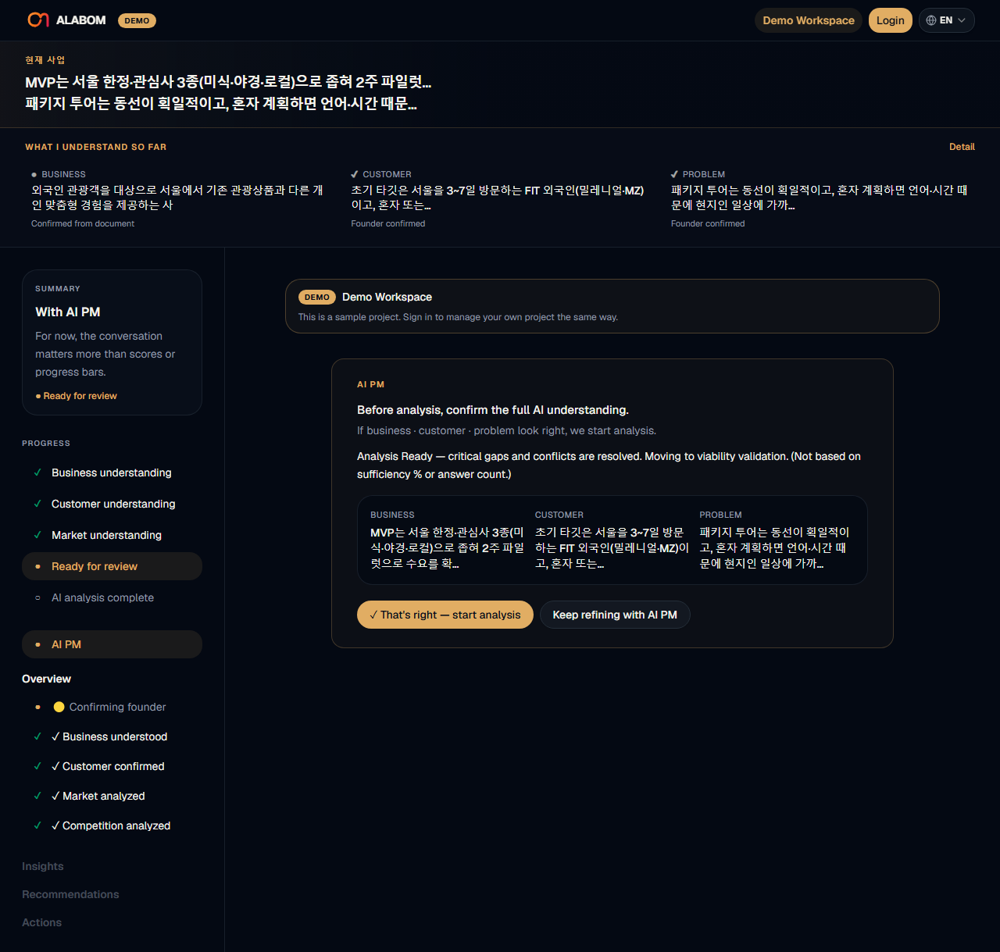

### Turn 22 — 17-gate-probe

**AI Q:** 

**User:** (gate probe)

**Delta:** (empty)

**Why now:** 

**Next Q:** 

### Turn 23 — 18-final-review

**AI Q:** 

**User:** (start analysis)

**Delta:** (empty)

**Why now:** 

**Next Q:** 

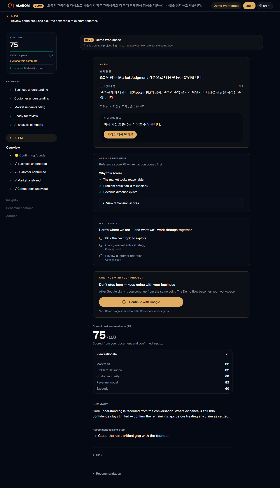

## Observations
- whyPanel: 지금 「그 차별점이 고객에게 왜 중요한가요?」을(를) 묻는 이유: 차별점이 고객에게 왜 중요한지 모르면 검증 설계를 할 수 없습니다. 고객 관련성을 지금 확인합니다. 핵심 공백은 「validationTestability」입니다. · 이미 문서·이전 답변으로 확인된 내용은 다시 묻지 않습니다. · 차별점이 고객에게 왜 중요한지 모르면 검증 설계를 할 수 없
- continue-refining reopen @meaningful=14
- StartAnalysis @17-gate-probe: visible=true; disabled=false; criticalCopy=false
- meaningfulAnswerCount=16
- duplicateAnswerCount=0
- paddingTurnCount=0
- whyPanelSeen=true
- conflictUiSeen=true
- reAskSameQuestionCount=0
- wrongSlotHints=0
- turnCount=23
- analysisVerdict=판단